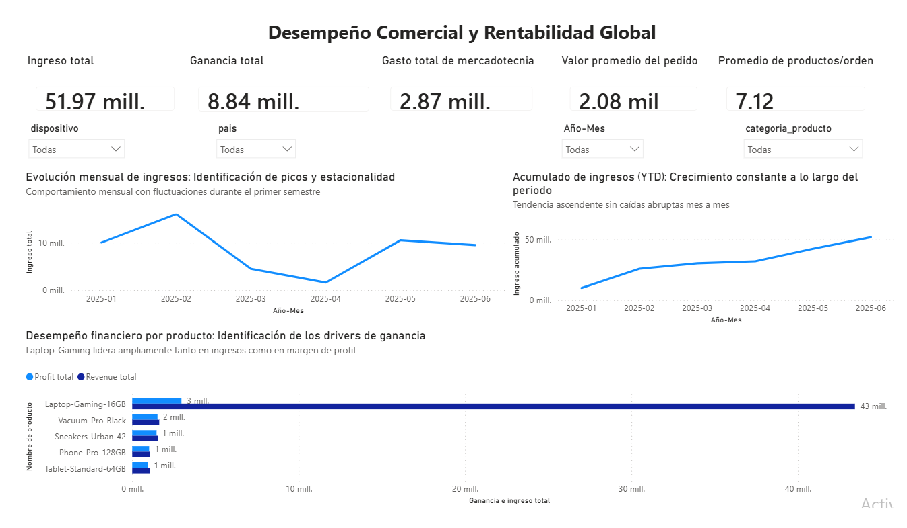

<h1 align="center">Hi, I'm Dante Mota 👋</h1>
<h3 align="center">Data Analyst · Turning Complex Data into Business Decisions</h3>

  
  

## About me
- 📊 Data analyst focused on **funnels, retention cohorts, A/B testing, and KPI dashboards** across industries.
- ⚙️ Background in electronic and instrumentation engineering, which shapes my rigor with data quality and measurement.
- 🌎 Bilingual (English/Spanish), based in Mexico, open to **remote Data Analyst roles**.

## Tech stack

## ⭐ Flagship project: RappiPlus end-to-end business diagnostic

Profitability, conversion funnel, retention cohorts, and an A/B test on a subscription service, from raw data to an executive Power BI dashboard.

**Highlights:** $51.97M revenue and $5.97M profit analyzed · funnel bottleneck located at checkout · 40–43% weekly retention across cohorts · checkout A/B test not significant (p = 0.416), so the rollout was not recommended.

[View repository](https://github.com/dantemota12/rappiplus-business-diagnostic)

## Featured projects
| Project | What it shows | Tools |
|---|---|---|
| [MercadoLibre funnel & retention](https://github.com/dantemota12/mercadolibre-funnel-retention-analysis) | Funnel narrows from 76.9% item selection to 1.25% purchase; steepest loss between item selection and add to cart | SQL |
| [Landing page A/B test](https://github.com/dantemota12/landing-page-ab-test-analysis) | Page B lifted conversion from 12.57% to 15.96% (p < 0.001) | Python, SciPy |
| [ConnectaTel churn & segmentation](https://github.com/dantemota12/connectatel-customer-behavior-analysis) | High-usage customers churn at 14.0% vs. ~11.5% in other tiers | Python, pandas |
| [Real estate dashboard](https://github.com/dantemota12/real-estate-sales-dashboard) | 11.14% YoY growth and a customer repurchase cohort matrix | Tableau |
| [Walmart sales dashboard](https://github.com/dantemota12/walmart-sales-performance-dashboard) | Department efficiency and share of sales with an interactive selector | Google Sheets |
| [Electronics retail analysis](https://github.com/dantemota12/electronics-retail-sales-analysis) | Data cleaning and KPIs on 753 sales transactions | Google Sheets |

## Let's connect
I'm always happy to talk about analytics, experimentation, and data storytelling. Reach me on [LinkedIn](https://www.linkedin.com/in/dante-mota/).
